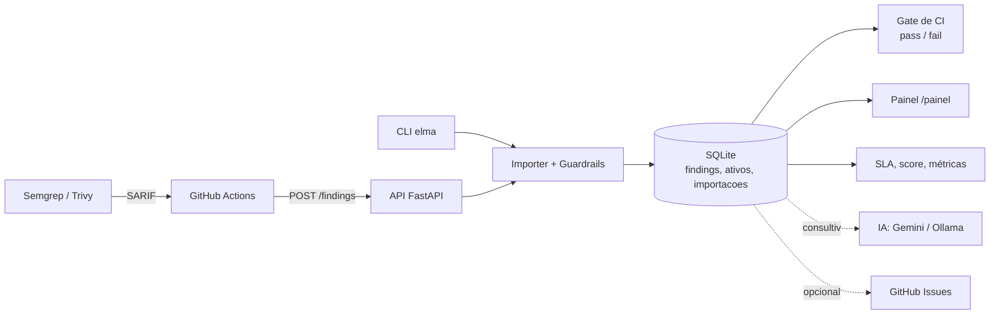

# Elma ASPM

**Application Security Posture Management leve, local e determinístico.**
A Elma recebe relatórios SARIF (Semgrep, Trivy e qualquer scanner compatível), deduplica os findings, guarda o histórico em SQLite e devolve um veredito de CI. Triagem, SLA, métricas, tickets e IA consultiva ficam por cima, sem nunca mudar a decisão do gate.

> Projeto do desafio ASPM + IA (FIAP Pride 2026).
Realizado por:
Mateus Dias Melo RM: 573692
Rodrigo
Lucas

---

## Por que a Elma

Scanners geram ruído: o mesmo achado aparece a cada push, falsos positivos voltam, e ninguém sabe o que está atrasado. A Elma resolve isso com uma camada de memória:

- **Fingerprint estável**: o achado é reconhecido mesmo que a linha mude.
- **Triagem persistente**: o que foi marcado como `falso_positivo` não reaparece; o que foi `corrigido` e voltou é reaberto como regressão.
- **Gate determinístico**: o CI passa ou falha por regra de severidade, sem depender de LLM ou de rede.
- **IA só como conselheira**: sugestões e remediações são gravadas à parte e nunca alteram status nem o resultado do CI.

## Funcionalidades

| Área | O que faz |
|---|---|
| Ingestão | SARIF 2.1.0 via CLI ou `POST /findings`; limite de 25 MB; runs/resultados malformados são contados e reprovam o gate |
| Deduplicação | Fingerprint = repositório + ferramenta + regra + arquivo + evidência mascarada |
| Severidade | Normalizada para `CRITICAL/HIGH/MEDIUM/LOW/INFO/UNKNOWN`; desconhecida **sempre bloqueia** (fail-closed) |
| Fechamento automático | Fecha findings ausentes só após scan concluído sem erro, com trava contra fechamento em massa |
| Priorização | Score por severidade × exposição × criticidade do ativo × parecer de IA |
| SLA | Prazo por severidade (derivado, sem migração), com atrasados no relatório, API e painel |
| Métricas | Aging, MTTR e tendência por dia |
| Ativos | Cadastro por repositório com tipo, exposição, criticidade e lacunas de tipos de scan |
| Tickets | Issue no GitHub ao confirmar um finding `CRITICAL` (dry-run por padrão) |
| IA consultiva | `suggest-ia` (falso positivo vs. real) e `remediar-ia`, com Gemini ou Ollama local |
| Guardrails | Mascaramento de segredos/CPF/CNPJ e filtro de prompt injection |
| Painel | Dashboard web em `/painel` |
| Relatórios | Terminal ou PDF com selo SHA-256 |

## Arquitetura



## Início rápido

```bash
git clone <seu-repo>
cd <seu-repo>
python -m pip install -r requirements.txt
cp .env.example .env   # ajuste as variáveis
```

Importar um SARIF e ver os findings:

```bash
python elma_cap8.py import-sarif semgrep.sarif --tipo sast --repo org/repo
python elma_cap8.py findings list --status novo
```

Subir a API e o painel:

```bash
export ELMA_API_KEY="uma-chave-forte"
uvicorn elma.api:app --host 0.0.0.0 --port 8000
# painel: http://localhost:8000/painel
```

## CLI

```bash
python elma_cap8.py <comando> [opções]
```

| Comando | Descrição |
|---|---|
| `import-sarif ARQ [--tipo T] [--repo R] [--close-missing] [--force-close]` | Importa um SARIF; sai com código 2 se houver itens descartados |
| `ci ARQ [--fail-on HIGH] [--tipo T] [--repo R] [--close-missing]` | Avalia o SARIF; código 1 reprova |
| `findings list [--status S] [--severity V] [--tipo T]` | Lista findings, marcando SLA atrasado |
| `findings show FINGERPRINT` | Detalhe de um finding, incluindo SLA e IA |
| `findings status FINGERPRINT VALOR` | `novo`, `confirmado`, `falso_positivo` ou `corrigido` |
| `findings suggest-ia [--severity V] [--limit N] [--force]` | Parecer consultivo de IA |
| `findings remediar-ia [--severity V] [--limit N] [--force]` | Orientação de remediação por IA |
| `report [--format terminal\|pdf] [--output ARQ] [--advice]` | Relatório de postura |
| `metrics` | Aging, MTTR, SLA e tendência |

Tipos de scan aceitos: `sast`, `sca`, `secrets`, `iac`, `container`, `k8s`, `dast`. O tipo é metadado e **não** altera o fingerprint.

Use `--db CAMINHO` em qualquer comando para apontar outro banco.

## Como o gate de CI decide

- Reprova (código 1) se existir finding ativo com severidade **igual ou acima** de `--fail-on` (padrão `HIGH`).
- Findings `falso_positivo` são ignorados.
- Severidade ausente ou desconhecida vira `UNKNOWN` e **sempre reprova**, para que metadado incompleto não passe em silêncio.
- SARIF com runs ou resultados descartados também reprova.
- O mapeamento SARIF é: `error→HIGH`, `warning→MEDIUM`, `note→LOW`, `none→INFO`. Scores numéricos de `security-severity` seguem as faixas CVSS (≥9 critical, ≥7 high, ≥4 medium, >0 low).

A IA nunca participa dessa decisão.

## API

Todas as rotas (exceto `/health` e `/painel`) exigem `Authorization: Bearer <ELMA_API_KEY>`.

| Método | Rota | Descrição |
|---|---|---|
| `POST` | `/findings` | Ingere SARIF e devolve `aprovado` + bloqueadores (sempre HTTP 200 se avaliou) |
| `GET` | `/findings` | Fila ordenada por score, com filtros e paginação |
| `GET` | `/findings/{fingerprint}` | Detalhe, ativo, score e SLA |
| `POST` | `/findings/{fingerprint}/status` | Triagem (dispara ticket ao confirmar / fecha ao corrigir) |
| `POST` | `/findings/{fingerprint}/analyze` · `/findings/analyze` | Parecer de IA (unitário / lote até 50) |
| `POST` | `/findings/{fingerprint}/remediate` · `/findings/remediate` | Remediação por IA |
| `GET` | `/postura` | Totais por severidade e status, novos em 7 dias, SLA |
| `GET` | `/metricas` | Aging, MTTR, tendência, SLA |
| `GET` | `/ativos` · `PATCH /ativos/{repositorio}` | Inventário e ajuste de exposição/criticidade |
| `GET` | `/ai/config` | Provedor e modelo de IA ativos |
| `GET` | `/painel` | Dashboard |
| `GET` | `/health` | Liveness, sem autenticação |

Exemplo de corpo do `POST /findings`:

```json
{
  "sarif": { "version": "2.1.0", "runs": [] },
  "fail_on": "HIGH",
  "repositorio": "org/repo",
  "tipo_scan": "sast",
  "fechar_ausentes": false
}
```

Códigos: `401` credencial, `409` conflito de fingerprint, `413` corpo grande demais, `422` payload inválido.

`fechar_ausentes=true` exige `repositorio` e `tipo_scan`. Um scan sem findings só fecha ausentes se a ferramenta atestar `executionSuccessful: true`; o Trivy não emite esse atestado, então o workflow o acrescenta apenas quando o step do scanner termina com sucesso.

## Integração com GitHub Actions

O workflow [`scan.yml`](.github/workflows/scan.yml) roda Semgrep e Trivy (SCA, secrets e IaC), guarda os SARIFs como artefato e envia cada um para a API da Elma. Se qualquer envio falhar ou qualquer gate reprovar, o pipeline falha.

Secrets necessários no repositório:

- `ELMA_API_URL`
- `ELMA_API_KEY`

## Configuração

| Variável | Padrão | Descrição |
|---|---|---|
| `ELMA_DB_PATH` | `elma_findings.db` | Caminho do SQLite |
| `ELMA_API_KEY` | (obrigatória na API) | Chave Bearer; sem ela a API recusa tudo |
| `ELMA_LLM_PROVIDER` | `gemini` | `gemini` ou `ollama` |
| `ELMA_GOOGLE_API_KEY` / `GOOGLE_API_KEY` | | Chave do Gemini |
| `ELMA_CLOUD_MODEL` | `gemini-2.5-flash` | Modelo Gemini |
| `ELMA_OLLAMA_MODEL` | `llama3.1` | Modelo Ollama |
| `ELMA_OLLAMA_BASE_URL` | `http://localhost:11434` | Endpoint Ollama |
| `ELMA_SLA_<SEVERIDADE>` | 15 / 30 / 90 / 120 | Prazo em dias (CRITICAL/HIGH/MEDIUM/LOW); INFO e UNKNOWN sem SLA |
| `ELMA_TICKETS_ATIVO` | `false` | Liga a integração de issues |
| `ELMA_TICKETS_DRY_RUN` | `true` | Só simula; desligue explicitamente para criar issues |
| `ELMA_GITHUB_TOKEN` | | Token com escrita de issues nos repositórios alvo |
| `ELMA_DASHBOARD_URL` / `ELMA_API_URL` | `http://localhost:8000` | Base do link do painel nas issues |

> Nunca versione tokens. Use o `.env` (ignorado pelo Git) ou o gerenciador de secrets do ambiente.

## Priorização por score

```
score = peso_severidade × fator_exposição × fator_criticidade × fator_ia
```

- **Peso**: CRITICAL 10, HIGH 7, MEDIUM 4, LOW 2, INFO 1, UNKNOWN 7.
- **Exposição**: `internet` 1.5, `interna` 1.0.
- **Criticidade do ativo** (1 a 5): fator de 0.6 a 1.4.
- **IA**: ×0.5 só quando o parecer é "provável falso positivo" com confiança ≥ 8.
- Findings `falso_positivo` e `corrigido` têm score 0.

É uma heurística de fila, não um veredito de segurança.

## Segurança e privacidade

- **Mascaramento de segredos** antes de persistir e antes de enviar a qualquer LLM: atribuições `password/token/api_key/secret`, JSON, senha em URL, chaves AWS, tokens GitHub/Google/Slack, JWT, chaves privadas PEM, CPF e CNPJ.
- **Prompt injection**: conteúdo de findings é tratado como dado não confiável; frases conhecidas (PT e EN) fazem o texto ser substituído por um placeholder.
- **Tickets**: findings com possível segredo ou do tipo `secrets` geram issue genérica, sem trecho, regra ou caminho. Texto do scanner é escapado e links são removidos.
- **Comparação de token** em tempo constante e limite de tamanho aplicado durante a leitura do corpo.

Esses controles são heurísticos (mapeados para OWASP LLM01 e LLM02); regex não garante cobertura total.

## Tickets no GitHub

Ao confirmar manualmente um finding `CRITICAL` (painel, API ou CLI), a Elma cria uma issue no repositório `owner/repo` do próprio finding. A ingestão SARIF nunca cria issue. A criação usa reserva atômica e reconciliação por marcador de fingerprint, e issues são fechadas/reabertas junto com o status do finding.

## Estrutura do projeto

```
elma/
  api.py          # FastAPI: ingestão, fila, IA, painel
  cli.py          # comandos da CLI
  db.py           # SQLite, migrações, fingerprint, agregações
  importer.py     # parse SARIF e fechamento de ausentes
  severity.py     # normalização e gate
  guardrails.py   # mascaramento e anti prompt injection
  priorizacao.py  # IA consultiva (Gemini/Ollama)
  risco.py        # score
  sla.py          # prazos de remediação
  metricas.py     # aging, MTTR, tendência
  tickets.py      # GitHub Issues
static/index.html # painel
tests/
.github/workflows/scan.yml
elma_cap8.py      # entry point de compatibilidade da CLI
elma_api.py       # entry point de compatibilidade (uvicorn elma_api:app)
```

## Limitações conhecidas (v1)

- Autenticação por **uma API key estática compartilhada**, sem token por repositório nem multi-tenant.
- SQLite local: não exponha a API publicamente sem rate limit e controle de acesso no deploy.
- MTTR só considera findings com timestamp de resolução (fechamento automático); correções manuais não entram na amostra.

## Licença

Defina a licença do projeto (por exemplo MIT) e adicione o arquivo `LICENSE`.
